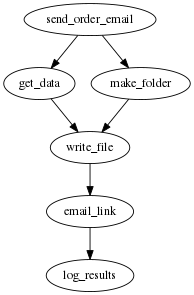

# async-auto-funcs: Helper functions and one wrapper for the awesome `async.auto`.

## Caolan's `async.auto` is awesome!

When you think about asynchronous code you realise that the code you're writing is full of little sub tasks and those sub tasks sometimes have some dependencies on other little sub tasks. Eventually you will come to the conclusion that your code could, and perhaps should be, represented similar to a graph.



When I think about code like this I often see things that either do not happen in parallel which should, or parameters come into a function for the sole purpose of being passed out of the function.

I recently discovered [async.auto](http://caolan.github.io/async/docs.html#.auto). If you've not seen this you should look at it. This amazing library enables the writing of code as a series of functions that have named dependencies on other functions, which in effect makes representing graphs like above in code possible. It can have trasformational effect on your code quality.

## If `async.auto` is so amazing, what is the purpose of the code here?

Looking through the docs for `async.auto` I was immediately struck by the power and awesomeness of it but there were tiny details I disliked...

### The parameters are ugly.

The first thing that struck me was that it forced my task functions to take an object parameter with many async results in it. The official example looks a bit like this:

```javascript
async.auto({
    get_data: function(callback) { ... },
    make_folder: function(callback) { ... },
    write_file: ['get_data', 'make_folder', function(results, callback) {
        var filename = results.make_folder + '/filename';
        fs.writeFile(results.get_data, filename, function(err) {
            callback(null, filename);
        });
    }],
    email_link: ['write_file', function(results, callback) {
        console.log('in email_link', JSON.stringify(results));
        // once the file is written let's email a link to it...
        // results.write_file contains the filename returned by write_file.
        callback(null, {'file':results.write_file, 'email':'user@example.com'});
    }]
}, function(err, results) {
    console.log('err = ', err);
    console.log('results = ', results);
})
```

This is all well and good and also, absolutely amazing but considering the function signature of `email_link` which is `function(results, callback)` something strange starts to reveal itself. The `results` paramater will have something like `{ get_data: 'YourDataHere', make_folder: 'folder', write_file: 'filename' }` stored within it, this has some downsides:

 1. The `email_link` function is not re-usable as it's signature is polluted by it's calling code. It would be much better to have a signature such as `function(filename, callback)`. 
 2. If the function `email_link` is stored in another file, perhaps very isolated from the the `async.auto` call itself later on someone may want to attach the file instead of linking and therefore you only the data stored in `results.get_data`. In the isolation of the `email_link` function this is good because we would not have to read the file to get data we already have but the consequence on the system is that it would make it libel to being broken by changes elsewhere in the system.
 3. Related to the previous point, in computer science terms we have unintentionally increased the coupling of the `email_link` function to the rest of the system.

### I understand all the computer science stuff, but is there anything else?

I sometimes want to be able to write and use functions that returned promises instead of using callbacks so I integrated that too.

## How does this code help?

This repository contains a few functions to compliment `async.auto` to smooth out the things I highlighted above.

### makeAsyncAutoTaskSpec / makeAsyncAutoTaskSpecP

The function `makeAsyncAutoTaskSpec` and it's Promise powered variant `makeAsyncAutoTaskSpecP` wrap the task functions in `async.auto` for the purpose of working with normal parameters.

You can now write:

```javascript
var makeAsyncAutoTaskSpec = require('async-auto-funcs').makeAsyncAutoTaskSpec;

function writeFile(data, folder, callback) {
    var fs = require('fs'),
        filename = folder + '/filename.txt';

    fs.writeFile(filename, data, function(err) {
        callback(null, filename);
    });
}

async.auto({
    ...
    write_file: makeAsyncAutoTaskSpec(
        ['get_data', 'make_folder'],
        writeFile
    ),
    ...
})
```

or:

```javascript
var makeAsyncAutoTaskSpecP = require('async-auto-funcs').makeAsyncAutoTaskSpecP;

function writeFileP(data, folder) {
    var fsp = require('fs-promise'),
        filename = folder + '/filename'.txt;

    return fsp.writeFile(filename, data)
        .then(function() {
            return filename;
        });
}

async.auto({
    ...
    write_file: makeAsyncAutoTaskSpecP(
        ['get_data', 'make_folder'],
        writeFileP
    ),
    ...
})
```

### makeAsyncAutoHandlerFunc

This is similar to `makeAsyncAutoTaskSpec` but is for the callback at the end of `async.auto`. It works like to this:

```javascript
var makeAsyncAutoHandlerFunc = require('async-auto-funcs').makeAsyncAutoHandlerFunc;

async.auto(
    {
        ...
        write_file: makeAsyncAutoTaskSpec(['get_data', 'make_folder'], () => { ... }),
        email_link: makeAsyncAutoTaskSpec(['write_file'], () => { ... }),
        ...
    },
    makeAsyncAutoHandlerFunc(
        ['email_link'],
        function(err, email) {
            console.log("Email sent to '" + email + "'");
        }
    )
)
```

### asyncAutoPromise

If you are:

 1. writing Promise based code in general.
 2. Your `async.auto` tasks use the `makeAsyncAutoTaskSpecP` which are Promise based too.
 
Then you find it a bit inconsistent that `async.auto` uses a final callback, which kind of breaks your happy Promise based world.

The existance of `asyncAutoPromise` converts `async.auto` into a Promise returning function so it can be used like the following:

```javascript
var asyncAutoPromise = require('async-auto-funcs').asyncAutoPromise;

asyncAutoPromise(
    {
        ...
        write_file: makeAsyncAutoTaskSpecP(['get_data', 'make_folder'], () => {}),
        email_link: makeAsyncAutoTaskSpecP(['write_file'], () => {}),
        ...
    },
    'email_link'
).then((email) => {
    console.log("Email sent to '" + email + "'");
});
```

But it can also be used like the following:

```javascript
var asyncAutoPromise = require('async-auto-funcs').asyncAutoPromise;

asyncAutoPromise(
    {
        ...
        write_file: makeAsyncAutoTaskSpecP(['get_data', 'make_folder'], () => {}),
        email_link: makeAsyncAutoTaskSpecP(['write_file'], () => {}),
        ...
    },
    function(allResults) {
        return 'mailto:' + allResults.email_link;
    }
).then((email) => {
    console.log("Email sent to '" + email + "'");
});
```


So it is just a pretty simple wrapper really but to me it feels like it has to be there to complete the job.
